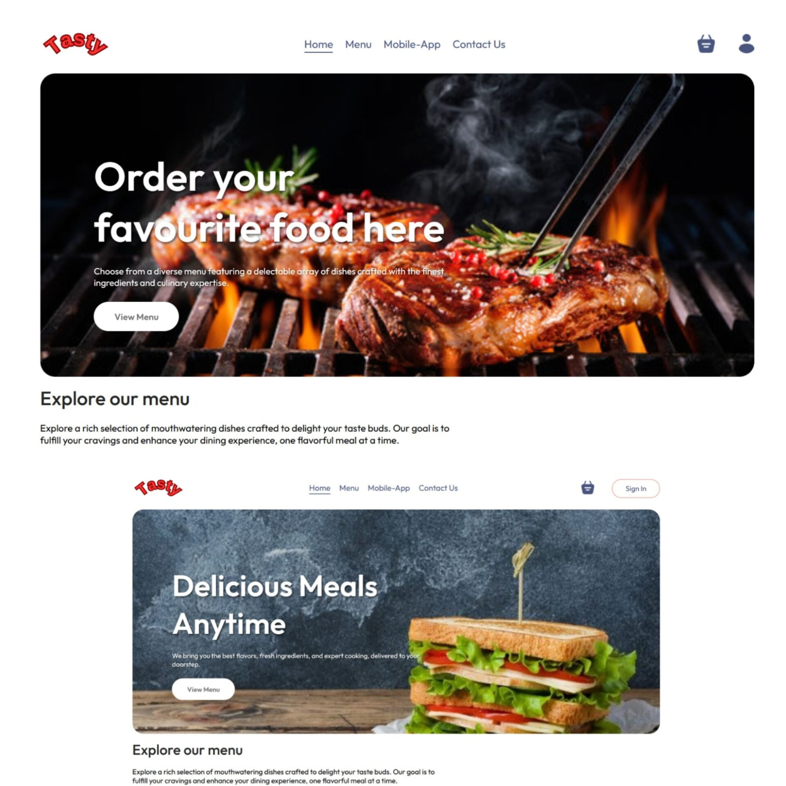
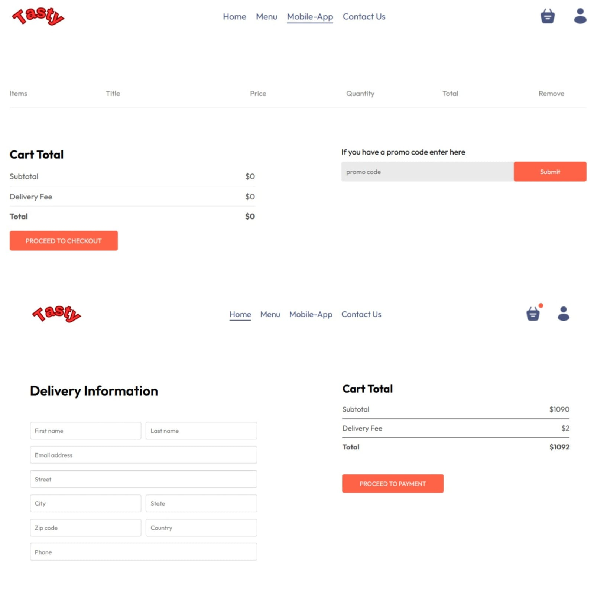
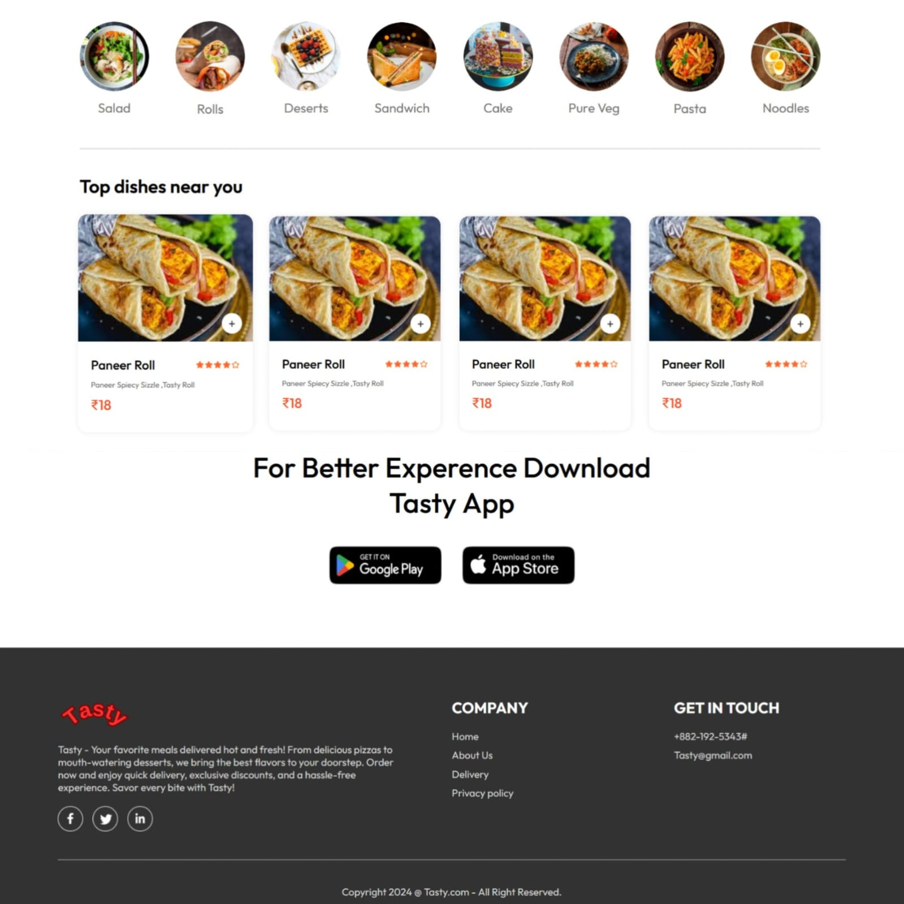
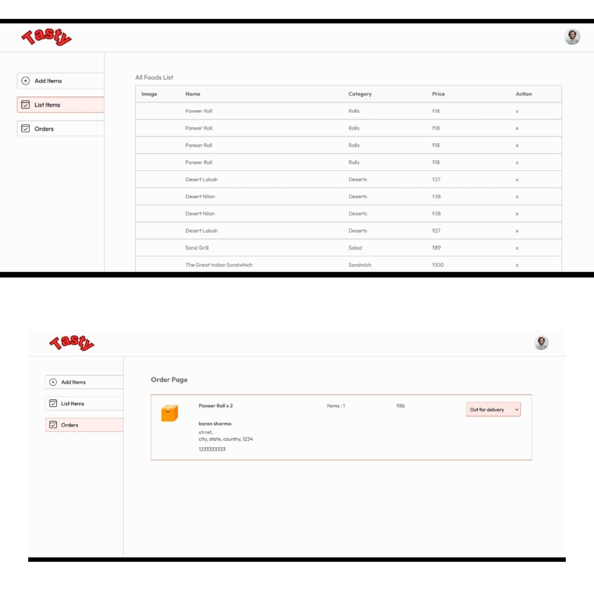

# Food Delivery App - Tasty

This project is a full-stack Food Delivery Website designed to provide a seamless and efficient experience for customers to browse, order food, and track their deliveries. It also includes an admin dashboard for managing food items, orders, and other essential operations.

Overview
The Food Delivery App is built with a modern tech stack and aims to simplify the entire food ordering process — from selecting meals to payment and order management. Whether you're a customer looking to order your favorite dishes or an admin managing the restaurant’s menu and orders, this application covers all the bases.

Features
User-Friendly Customer Interface:
Customers can easily browse menus, search for dishes, add items to their cart, and place orders with a smooth and responsive frontend interface.

Secure Online Payments:
Integration with Stripe allows customers to pay securely using various payment methods, ensuring a reliable checkout experience.

Real-time Order Management:
The backend manages incoming orders, updates their statuses, and coordinates data between customers and admins.

Admin Dashboard:
Restaurant staff or administrators can manage the food menu, update prices and availability, track orders in real-time, and oversee overall operations through a dedicated admin panel.

Image Handling:
Cloudinary is used to store, optimize, and serve food images, improving performance and visual appeal.

Database:
MongoDB Atlas provides a scalable and secure cloud database to store user profiles, orders, food items, and other essential data.

Architecture
The application consists of three main components:

1. Frontend (Customer App)
Built with React (or your frontend framework) to offer a rich and interactive user experience.

Features include menu browsing shopping cart, user authentication, and order tracking.

2. Backend (Server)
Developed using Node.js and Express (or your backend tech) to handle API requests, business logic, and data management.

Responsible for processing orders, user authentication, payment integration with Stripe, and communication with the database.

3. Admin Panel
A protected dashboard for administrators to manage food items, update availability, monitor order statuses, and generate reports.

Includes secure login and role-based access control.

Technologies Used
Stripe: For secure and flexible payment processing.

Cloudinary: For efficient image upload, storage, and delivery.

MongoDB Atlas: Cloud-hosted NoSQL database for storing user data, orders, and menu items.

React: For building the responsive frontend customer interface.

Node.js & Express: For server-side logic and API endpoints.

JWT / OAuth: For secure user authentication.
